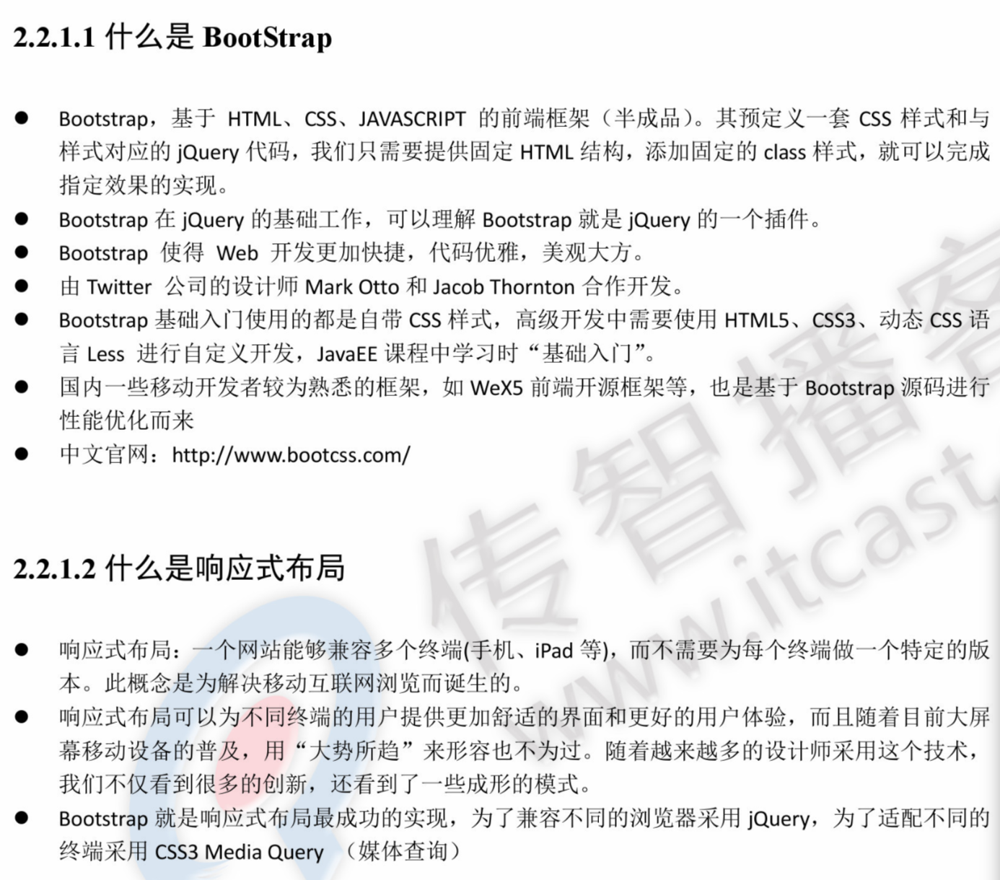

# BootStrap

## （Web前端CSS框架）

Bootstrap，来自 Twitter，是目前很受欢迎的前端框架。Bootstrap 是基于 HTML、CSS、JAVASCRIPT 的，它简洁灵活，使得 Web 开发更加快捷。

它由Twitter的设计师Mark Otto和Jacob Thornton合作开发，是一个CSS/HTML框架。Bootstrap提供了优雅的HTML和CSS规范，它即是由动态CSS语言

写成。Bootstrap一经推出后颇受欢迎，一直是GitHub上的热门开源项目，包括NASA的MSNBC（微软全国广播公司）的Breaking News都使用了该项目。

国内一些移动开发者较为熟悉的框架，如WeX5前端开源框架等，也是基于Bootstrap源码进行性能优化而来。

