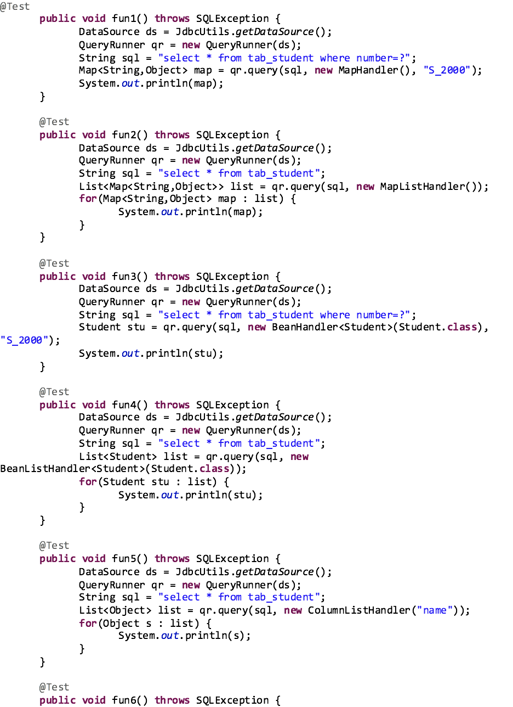

# configuration

```text
 public void loginTest() {

        try {
            //获取ds资源
            DataSource dataSource = new ComboPooledDataSource();
            //获取核心程序
            QueryRunner queryRunner = new QueryRunner(dataSource);
            String sql = "insert into user value(?, ?, ?)";
            Object[] params = {2, "test", "test"};
            //通过queryRUnner进行query查询
            int row = queryRunner.update(sql, params);
            if (row > 0) {
                //System.out.println("id: " + rs.getInt(1) + "name: " + rs.getString(2) + "pass:" +rs.getString(3));
                System.out.println("success");
            } else System.out.println("failed");
        }
        catch (Exception exception){
            throw new RuntimeException(exception);
        }

    }
```



